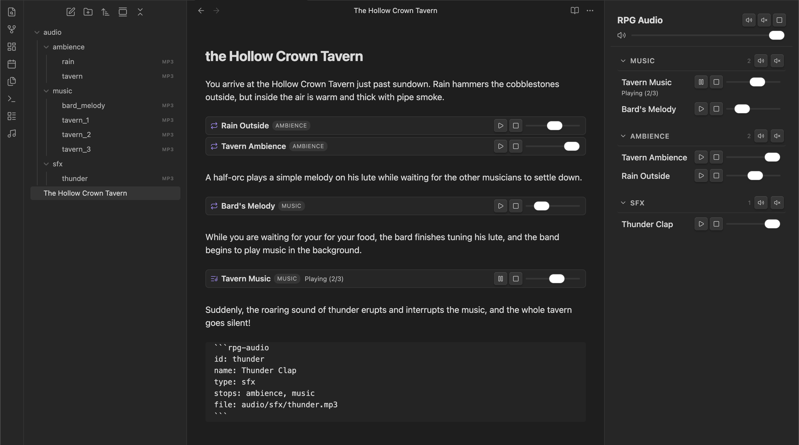

# RPG Audio

Turn your session prep notes into a soundboard — ambience, music, and sound effects, all controlled from within Obsidian.

<!-- TODO: screenshot of a note with inline players next to session prep text -->


## Features

- **Inline players** — add `rpg-audio` code blocks to any note and get play/pause, stop, and volume controls right next to your encounter text
- **Sidebar** — a dedicated panel showing all tracks grouped by type, with global and per-group fade controls
- **Crossfade** — tracks with `stops:`, `pauses:`, or `starts:` automatically crossfade between each other (configurable duration, or instant)
- **Playlists** — list multiple files and they play in sequence, with optional looping
- **Layered audio** — run ambience, music, and sound effects simultaneously with independent volume controls
- **Fade controls** — fade in/out individual groups (e.g. fade out all ambience) or everything at once

## Use cases

- **GMs who prep in Obsidian** — embed audio controls right next to your encounter notes. When the party enters the tavern, hit play without alt-tabbing.
- **Layered soundscapes** — run rain ambience, tavern chatter, and a bard's tune simultaneously, each with its own volume.
- **One-click scene transitions** — use `stops:` to crossfade from exploration music to battle music with a single button press. Use `pauses:` and `starts:` for temporary transitions that resume where they left off.
- **Solo RPG / journaling** — set the mood for your solo sessions.

## Quick start

1. Create an `audio/` folder in your vault and drop some `.mp3` files in it
2. Add this to any note:

````markdown
```rpg-audio
id: tavern
name: Tavern Ambience
loop: true
file: audio/tavern.mp3
```
````

3. Switch to reading mode — hit play

## Usage

Add an `rpg-audio` fenced code block to any note to create an audio player:

````markdown
```rpg-audio
id: tavern-music
name: Tavern Music
file: audio/tavern-ambience.mp3
```
````

This renders an inline player widget with play/pause, stop, and volume controls.

### Fields

| Field   | Required | Description |
|---------|----------|-------------|
| `id`    | Yes      | Unique identifier for the track. Used internally to manage playback state. |
| `name`  | Yes      | Display name shown in the player widget and sidebar. |
| `type`  | No       | Label shown as a badge on the player (e.g. `sfx`, `ambience`, `playlist`). Defaults to `playlist` when multiple files are provided, `sfx` otherwise. |
| `loop`  | No       | `true` or `false`. For single-file tracks, loops the file. For multi-file tracks, continues to the next track when one ends (sequentially or shuffled). When `false`, plays one track and stops. Defaults to `false`. |
| `random` | No      | `true` or `false`. When enabled, picks a random track on play and (with `loop: true`) shuffles to a different track each time. Defaults to `false`. |
| `stops`     | No   | Comma-separated list of types to stop when this track starts playing (e.g. `music, ambience`). If a crossfade duration is configured, the outgoing tracks fade out. |
| `pauses`    | No   | Comma-separated list of types to pause when this track starts playing (e.g. `ambience`). Like `stops`, but paused tracks keep their position and can be resumed later. Fades out if crossfade is configured. |
| `starts`    | No   | Comma-separated list of types to resume when this track starts playing (e.g. `ambience`). Resumes tracks that were previously paused. Fades in if crossfade is configured. |
| `file`  | \*       | Path to a single audio file, relative to the vault root (e.g. `audio/thunder.mp3`). |
| `files` | \*       | A list of audio files (one per line, prefixed with `- `). Files play in order as a playlist. |

\* At least one `file` or `files` entry is required.

### Examples

**Sound effect (one-shot):**

````markdown
```rpg-audio
id: thunder
name: Thunder Clap
type: sfx
file: audio/sfx/thunder.mp3
```
````

**Looping ambience:**

````markdown
```rpg-audio
id: rain
name: Rain
type: ambience
loop: true
file: audio/ambience/rain.mp3
```
````

**Playlist:**

````markdown
```rpg-audio
id: battle-music
name: Battle Music
type: playlist
loop: true
files:
- audio/music/battle-01.mp3
- audio/music/battle-02.mp3
- audio/music/battle-03.mp3
```
````

Add `loop: true` to play through all tracks in order and repeat. Without it, only one track plays and stops.

**Shuffled playlist:**

````markdown
```rpg-audio
id: battle-music
name: Battle Music
type: playlist
loop: true
random: true
files:
- audio/music/battle-01.mp3
- audio/music/battle-02.mp3
- audio/music/battle-03.mp3
```
````

With `random: true`, playback starts on a random track and shuffles to a different track each time one ends. Resuming from pause keeps the current track.

**Randomized sound effect (one-shot):**

````markdown
```rpg-audio
id: sword-hit
name: Sword Hit
type: sfx
random: true
loop: false
files:
- audio/sfx/sword-hit-01.mp3
- audio/sfx/sword-hit-02.mp3
- audio/sfx/sword-hit-03.mp3
```
````

With `random: true` and `loop: false`, each press of play triggers a random sound from the list. Great for varied sound effects.

**Music tracks that stop other music (only one plays at a time):**

````markdown
```rpg-audio
id: tavern-music
name: Tavern Music
type: music
stops: music
loop: true
file: audio/music/tavern.mp3
```
````

With `stops: music`, starting this track will automatically stop any other playing track that has `type: music`. You can list multiple types separated by commas (e.g. `stops: music, ambience`). If a crossfade duration is configured in settings, the outgoing tracks fade out while the new one fades in.

**Scene transitions with pause/resume:**

````markdown
```rpg-audio
id: outside-ambience
name: Outside Ambience
type: ambience
loop: true
file: audio/ambience/forest.mp3
```
````

````markdown
```rpg-audio
id: enter-house
name: Enter House
type: sfx
pauses: ambience
file: audio/sfx/door-open.mp3
```
````

````markdown
```rpg-audio
id: exit-house
name: Exit House
type: sfx
starts: ambience
file: audio/sfx/door-close.mp3
```
````

Play "Outside Ambience", then hit "Enter House" — the ambience pauses (with fade-out if crossfade is on). Later, hit "Exit House" and the ambience picks up right where it left off (with fade-in).

## Sidebar

Click the music note icon in the ribbon (or run the **Toggle audio sidebar** command) to open a sidebar panel. The sidebar shows:

- **Global controls** — Fade In All, Fade Out All, and Stop All buttons
- **Master volume slider** — controls the global volume for all tracks
- **Tracks grouped by type** — collapsible sections for each type (music, ambience, sfx, etc.)
- **Per-group fade controls** — fade in or fade out all tracks of a specific type (e.g. fade out all ambience while keeping music playing)
- **Per-track controls** — play/pause, stop, and volume slider for each track
- **Playlist status** — shows current position for multi-file tracks (e.g. "Playing 2/5")

## Tips

- Use `stops: music` on all your music tracks so only one plays at a time — switching scenes is a single click
- Use `pauses:` and `starts:` for temporary scene changes (e.g. entering/leaving a building) where you want audio to resume from where it left off
- Keep ambience and SFX as separate types so you can fade out ambience without killing sound effects
- Organize your audio folder by type: `audio/music/`, `audio/ambience/`, `audio/sfx/`
- File paths can be absolute from the vault root (`audio/music/tavern.mp3`) or relative to the configured audio folder (`music/tavern.mp3`)

## Settings

- **Audio folder** — vault-relative folder where your audio files are stored (default: `audio`).
- **Master volume** — global volume multiplier applied to all tracks.
- **Auto-open sidebar** — automatically open the sidebar when the plugin loads.
- **Crossfade duration** — duration in milliseconds of the crossfade between exclusive tracks (default: 2000ms). Set to 0 to disable crossfading and use hard stops.

## Commands

- **Toggle audio sidebar** — show or hide the audio sidebar panel.
- **Stop all audio** — stop all currently playing tracks.

## Caveats

- **Tracks appear in the sidebar only while the note containing them is open in the editor.** If you close the note, its tracks disappear from the sidebar. This is by design — the plugin reads `rpg-audio` code blocks from open documents — but it can be surprising at first. Keep your session notes open during play.

## Limitations

- **Desktop only** — no mobile/tablet support
- **Local files only** — plays audio from your vault, not streaming services or URLs
- **No seek/scrubber** — play, pause, and stop only; no jumping to a specific timestamp
- **No weighted random** — `random: true` gives each track equal probability; no way to bias towards specific tracks
- **No persistent state** — playback resets when Obsidian restarts
- **Supported formats** — depends on Electron's audio engine; MP3, OGG, WAV, FLAC, and AAC generally work

## Installation

### BRAT (recommended for beta testing)

1. Install the [BRAT](https://github.com/TfTHacker/obsidian42-brat) plugin
2. In BRAT settings, click **Add Beta Plugin**
3. Enter `knorrli/obsidian-rpg-audio`
4. Enable **RPG Audio** in Settings > Community Plugins

### Manual

1. Download `main.js`, `styles.css`, and `manifest.json` from the [latest release](https://github.com/knorrli/obsidian-rpg-audio/releases/latest)
2. Create a folder at `.obsidian/plugins/rpg-audio/` in your vault
3. Copy the three files into that folder
4. Enable **RPG Audio** in Settings > Community Plugins

## Development

This plugin was built for my own tabletop sessions. I'm sharing it because it might be useful or serve as inspiration for others, but I don't have the time to actively maintain it in the traditional open-source sense. Don't expect quick responses to issues, feature requests, or pull requests — I may not monitor them regularly.

That said, the code is yours to do with as you please (see [License](#license)):

- **Fork it** — click "Fork" on GitHub to get your own copy. Make whatever changes you want.
- **Pull requests** — if you fix a bug or add something useful, feel free to open a PR. I may merge it eventually, but no promises on timing.
- **Issues** — you're welcome to report bugs, but self-service fixes via PRs are more likely to get addressed.
- **Local development** — clone the repo into your vault's `.obsidian/plugins/rpg-audio/` folder, run `npm install`, then `npm run dev` to build with hot reload.

## AI disclaimer

This plugin was built with the help of AI (Claude). If that matters to you, now you know.

## License

[0-BSD](LICENSE)
