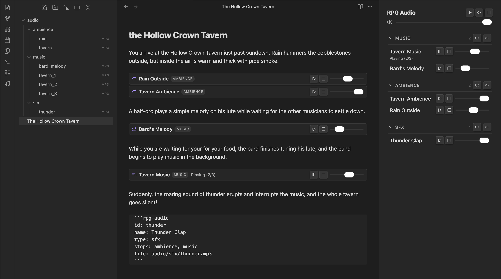

# RPG Audio

Turn your session prep notes into a soundboard — ambience, music, and sound effects, all controlled from within Obsidian.

<!-- TODO: screenshot of a note with inline players next to session prep text -->


## Features

- **Inline players** — add `rpg-audio` code blocks to any note and get play/pause, stop, and volume controls right next to your encounter text
- **Sidebar** — a dedicated panel showing all tracks grouped by type, with global and per-group fade controls
- **Scene transitions via `scope:`** — label tracks with one or more context tags; playing a scoped track automatically stops tracks from other scopes
- **Crossfade** — exclusive transitions fade smoothly (configurable duration, or instant)
- **Playlists** — list multiple files and they play in sequence, with optional looping
- **Layered audio** — run ambience, music, and sound effects simultaneously with independent volume controls
- **Fade controls** — fade in/out individual groups (e.g. fade out all ambience) or everything at once
- **Autoplay** — mark tracks with `autoplay: true` and they start playing as soon as their note opens or is shown in a hover popover. Gated by a sidebar toggle so prep stays silent and you only flip it on at the start of a session
- **Insert track command** — a GUI modal for building `rpg-audio` code blocks without remembering the syntax
- **Debug overlay** — optional sidebar toggle that shows each track's last event and the active scope set, useful when audio behaves unexpectedly

## Use cases

- **GMs who prep in Obsidian** — embed audio controls right next to your encounter notes. When the party enters the tavern, hit play without alt-tabbing.
- **Layered soundscapes** — run rain ambience, tavern chatter, and a bard's tune simultaneously, each with its own volume.
- **Scene-based audio** — tag tracks by location or context with `scope:`. Switching scenes is a single click and the previous scene's audio steps aside automatically.
- **Solo RPG / journaling** — set the mood for your solo sessions.

## Quick start

1. Create an `audio/` folder in your vault and drop some `.mp3` files in it
2. Add this to any note:

````markdown
```rpg-audio
id: tavern
name: Tavern Ambience
loop: true
file: audio/tavern.mp3
```
````

3. Switch to reading mode — hit play

## Common patterns

### A single looping track

````markdown
```rpg-audio
id: rain
name: Rain
type: ambience
loop: true
file: audio/ambience/rain.mp3
```
````

### A layered scene (music + ambience + sfx)

Define multiple tracks in the same note. They share controls but play independently, each with its own volume.

````markdown
```rpg-audio
id: tavern-music
name: Tavern Music
type: music
loop: true
file: audio/music/tavern.mp3
```

```rpg-audio
id: tavern-chatter
name: Tavern Chatter
type: ambience
loop: true
file: audio/ambience/tavern-chatter.mp3
```

```rpg-audio
id: door-creak
name: Door Creak
type: sfx
file: audio/sfx/door-creak.mp3
```
````

### Scene transitions with `scope:`

`scope:` is a comma-separated list of context labels (any strings you choose). When a scoped track starts playing, the engine sets the **active scope** to that track's labels and stops any other playing track whose scope isn't a subset of the new active set. Tracks with the same scope coexist; tracks without a `scope:` are unaffected by transitions.

````markdown
```rpg-audio
id: tavern-music
name: Tavern Music
type: music
scope: tavern
loop: true
file: audio/music/tavern.mp3
```

```rpg-audio
id: tavern-amb
name: Tavern Ambience
type: ambience
scope: tavern
loop: true
file: audio/ambience/tavern-chatter.mp3
```

```rpg-audio
id: forest-music
name: Forest Music
type: music
scope: forest
loop: true
file: audio/music/forest.mp3
```
````

Starting `tavern-music` plays alongside `tavern-amb` (same scope). When you later trigger `forest-music`, both tavern tracks stop automatically — no per-track directives needed.

Multi-scope is supported: `scope: outdoors, district-1` means the track belongs to *both* contexts. It keeps playing as long as every label it claims is part of the active scope. So a track scoped `outdoors` survives transitions between any `outdoors, …` scopes (handy for weather beds and region-spanning atmospheres).

### Playlists

````markdown
```rpg-audio
id: battle-music
name: Battle Music
type: playlist
loop: true
files:
- audio/music/battle-01.mp3
- audio/music/battle-02.mp3
- audio/music/battle-03.mp3
```
````

Add `random: true` to shuffle. Without `loop: true`, only one track plays and stops — paired with `random: true` this gives you a varied one-shot SFX (e.g. sword hits).

## Sidebar

Click the music note icon in the ribbon (or run the **Toggle audio sidebar** command) to open a sidebar panel. The sidebar shows:

- **Global controls** — Fade In All, Fade Out All, and Stop All buttons
- **Master volume slider** — controls the global volume for all tracks
- **Tracks grouped by type** — collapsible sections for each type (music, ambience, sfx, etc.)
- **Per-group fade controls** — fade in or fade out all tracks of a specific type
- **Per-track controls** — play/pause, stop, and volume slider for each track
- **Playlist status** — current position for multi-file tracks (e.g. "Playing 2/5")
- **Debug toggle** — bug icon in the footer reveals scope labels, last-event info per track, and the active scope set

## Field reference

| Field   | Required | Description |
|---------|----------|-------------|
| `id`    | Yes      | Unique identifier for the track. Used internally to manage playback state. |
| `name`  | Yes      | Display name shown in the player widget and sidebar. |
| `type`  | No       | Label shown as a badge on the player (e.g. `sfx`, `ambience`, `playlist`). Defaults to `playlist` when multiple files are provided, `sfx` otherwise. |
| `scope` | No       | Comma-separated context labels (e.g. `tavern` or `outdoors, district-1`). Playing a scoped track stops other-scope tracks. See [Scene transitions with scope](#scene-transitions-with-scope). |
| `loop`  | No       | `true` or `false`. For single-file tracks, loops the file. For multi-file tracks, continues to the next track when one ends (sequentially or shuffled). When `false`, plays one track and stops. Defaults to `false`. |
| `random` | No      | `true` or `false`. When enabled, picks a random track on play and (with `loop: true`) shuffles to a different track each time. Defaults to `false`. |
| `autoplay` | No    | `true` or `false`. When enabled, the track starts playing as soon as it is rendered (e.g. when the note is opened or shown in a hover popover). Requires the sidebar autoplay toggle to be on. Defaults to `false`. |
| `stops`     | No   | Comma-separated list of types or track IDs to stop when this track starts playing. Prefix a token with `!` to exclude. See [Advanced directives](#advanced-directives). |
| `pauses`    | No   | Like `stops`, but paused tracks keep their position and can be resumed later. |
| `resumes`   | No   | Comma-separated list of types or track IDs to resume when this track starts. Only affects tracks that are currently paused. |
| `file`  | \*       | Path to a single audio file, relative to the vault root (e.g. `audio/thunder.mp3`). |
| `files` | \*       | A list of audio files (one per line, prefixed with `- `). Files play in order as a playlist. |

\* At least one `file` or `files` entry is required.

## Advanced directives

Most scene-transition use cases are covered by `scope:`. The `stops:` / `pauses:` / `resumes:` directives remain useful for:

- **One-shot SFX that pauses background audio** — a door-open sfx that pauses ambience until a matching door-close sfx resumes it. This needs explicit pause/resume because you want resume-from-position behavior, which scope's stop semantics don't provide.
- **Cross-cutting exceptions** — silence a global music bed during a dramatic NPC theme without giving the bed a scope.
- **Surgical per-id targeting** — `stops: <some-id>` to stop one specific track when this one plays.

### Pause-and-resume SFX example

````markdown
```rpg-audio
id: outside-ambience
name: Outside Ambience
type: ambience
loop: true
file: audio/ambience/forest.mp3
```

```rpg-audio
id: enter-house
name: Enter House
type: sfx
pauses: ambience
file: audio/sfx/door-open.mp3
```

```rpg-audio
id: exit-house
name: Exit House
type: sfx
resumes: ambience
file: audio/sfx/door-close.mp3
```
````

Play "Outside Ambience", then hit "Enter House" — the ambience pauses. Later, hit "Exit House" and the ambience picks up where it left off.

### Negation

Prefix a token with `!` to exclude it. Example: `stops: ambient, !crowd-ambient` stops every track of type `ambient` except the one with id `crowd-ambient`. With `scope:` available, negation is rarely needed for scene transitions, but it remains useful for the cross-cutting cases above.

## Tips

- Reach for `scope:` first when you want "playing a track means switching to its scene." Reach for `stops:` / `pauses:` / `resumes:` for explicit one-shot transitions or cross-cutting exceptions.
- Keep ambience and SFX as separate types so you can fade out ambience without killing sound effects.
- Organize your audio folder by type: `audio/music/`, `audio/ambience/`, `audio/sfx/`.
- File paths can be absolute from the vault root (`audio/music/tavern.mp3`) or relative to the configured audio folder (`music/tavern.mp3`).
- When something behaves unexpectedly, toggle the debug bug icon in the sidebar footer to see why each track is in its current state.

## Settings

- **Audio folder** — vault-relative folder where your audio files are stored (default: `audio`).
- **Master volume** — global volume multiplier applied to all tracks.
- **Auto-open sidebar** — automatically open the sidebar when the plugin loads.
- **Crossfade duration** — duration in milliseconds of the crossfade between exclusive tracks (default: 2000ms). Set to 0 to disable crossfading and use hard stops.
- **Play fade duration** — duration in milliseconds of the fade applied when starting, pausing, and resuming a track (default: 0ms / instant). Clicking play during a fade-out reverses into a fade-in (and vice versa).

## Commands

- **Toggle audio sidebar** — show or hide the audio sidebar panel.
- **Stop all audio** — stop all currently playing tracks.
- **Insert audio track** — opens a modal to build and insert an `rpg-audio` code block at the cursor.

## Caveats

- **Tracks appear in the sidebar only while the note containing them is open in the editor.** If you close the note, its tracks disappear from the sidebar. This is by design — the plugin reads `rpg-audio` code blocks from open documents — but it can be surprising at first. Keep your session notes open during play.

## Limitations

- **Mobile/tablet volume sliders** — on mobile and tablet, dragging volume sliders in editing mode may conflict with Obsidian's swipe-to-open-sidebar gesture. Switch to reading mode for smoother slider control.
- **Local files only** — plays audio from your vault, not streaming services or URLs.
- **No seek/scrubber** — play, pause, and stop only; no jumping to a specific timestamp.
- **No weighted random** — `random: true` gives each track equal probability; no way to bias towards specific tracks.
- **No persistent state** — playback resets when Obsidian restarts.
- **Supported formats** — depends on Electron's audio engine; MP3, OGG, WAV, FLAC, and AAC generally work.

## Installation

### BRAT (recommended for beta testing)

1. Install the [BRAT](https://github.com/TfTHacker/obsidian42-brat) plugin
2. In BRAT settings, click **Add Beta Plugin**
3. Enter `knorrli/obsidian-rpg-audio`
4. Enable **RPG Audio** in Settings > Community Plugins

### Manual

1. Download `main.js`, `styles.css`, and `manifest.json` from the [latest release](https://github.com/knorrli/obsidian-rpg-audio/releases/latest)
2. Create a folder at `.obsidian/plugins/rpg-audio/` in your vault
3. Copy the three files into that folder
4. Enable **RPG Audio** in Settings > Community Plugins

## Development

This plugin was built for my own tabletop sessions. I'm sharing it because it might be useful or serve as inspiration for others, but I don't have the time to actively maintain it in the traditional open-source sense. Don't expect quick responses to issues, feature requests, or pull requests — I may not monitor them regularly.

That said, the code is yours to do with as you please (see [License](#license)):

- **Fork it** — click "Fork" on GitHub to get your own copy. Make whatever changes you want.
- **Pull requests** — if you fix a bug or add something useful, feel free to open a PR. I may merge it eventually, but no promises on timing.
- **Issues** — you're welcome to report bugs, but self-service fixes via PRs are more likely to get addressed.
- **Local development** — clone the repo into your vault's `.obsidian/plugins/rpg-audio/` folder, run `npm install`, then `npm run dev` to build with hot reload.

## AI disclaimer

This plugin was built with the help of AI (Claude). If that matters to you, now you know.

## License

[0-BSD](LICENSE)
